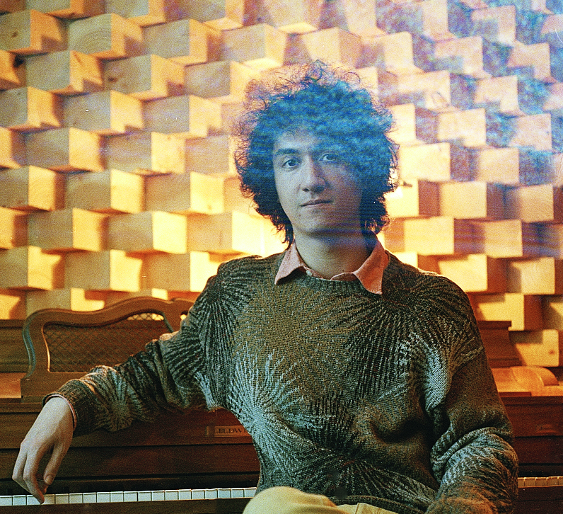

I am a data scientist and research engineer primarily experienced with machine learning for audio (music and speech). Although I started my career in the recording industry, gaining experience through producing sessions for voice-over artists, film post-production teams, and musicians, I have recently finished my masters in Audio Engineering at the University of Derby with a focus on automatic speech recognition systems and audio DSP. I am interested in following my interests in the data science and research field in order to continue my pursuit in ASR and machine learning.  I am currently a student at the Metis Data Science Bootcamp in NYC. 

I also love history audiobooks, Star Wars, and games, particularly board games!
